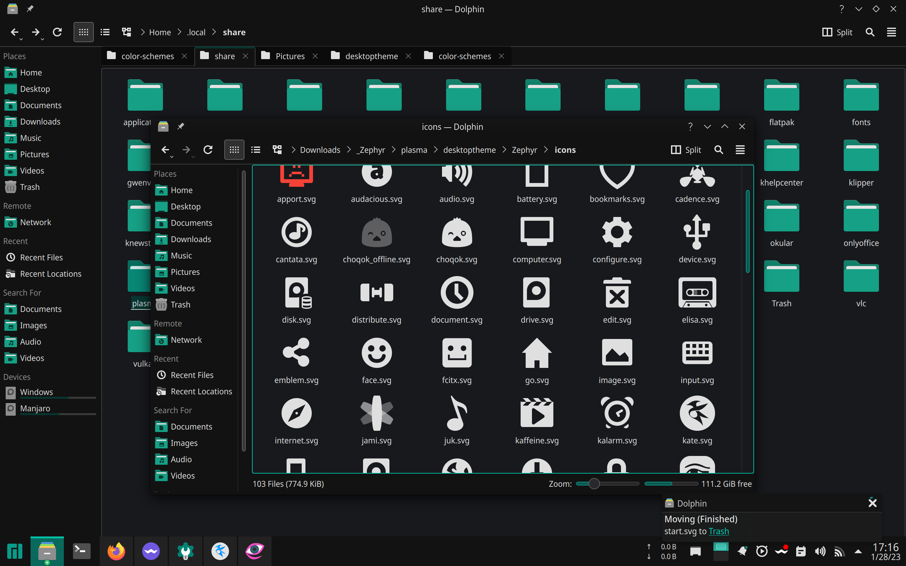
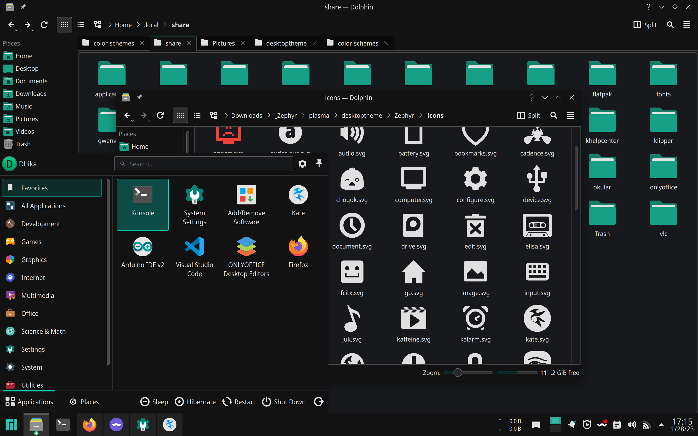
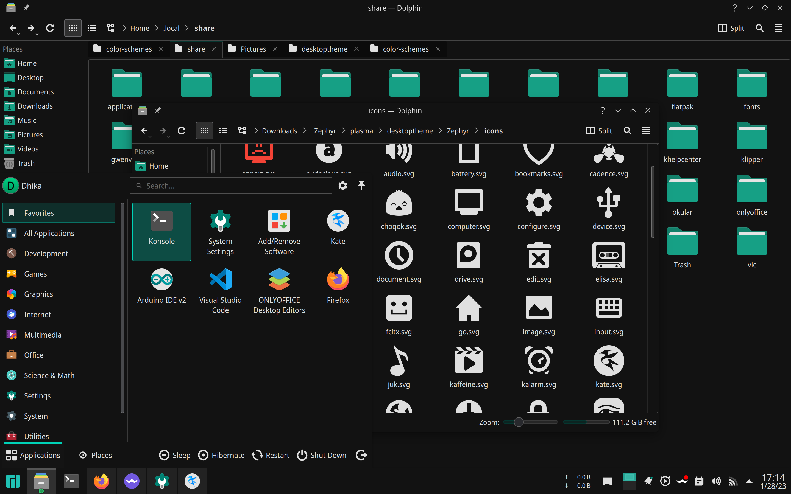

### About Zephyr

Zephyr is a synonym for Breeze, the default theme in most KDE distros. Almost everything will fallback to your chosen theme, except for color scheme and desktop/tray icons which are replaced with Materia/Papirus icons (slightly modified). This ensures minimal maintenance if changes are made upstream.

### Color Schemes

There are 2 color schemes, see screenshots below.

1. Zephyr Dark, a dark theme based on the Materia color scheme. Replaced some of the grayish color with a darker one.
2. Zephyr Darker, a variant of Zephyr Dark where some elements are even darker (reduced background color variation).

### Screenshots

Zephyr Dark

Zephyr Dark with start menu

Zephyr Darker with start menu

### Install Directories

Choose what you need:

- For color scheme, copy matching folder to `~/.local/share/color-schemes`
- For konsole theme, copy matching folder to `~/.local/share/konsole`
- For plasma (desktop/tray) icons, copy matching folder to `~/.local/share/plasma`. For application icons, just use Papirus icons.

### Change Start Menu Icon

The default start menu icon is Manjaro logo. Simply replace `~/.local/share/plasma/desktoptheme/Zephyr/icons/start.svg` with something else. The default KDE logo is also supplied, rename `start_kde.svg` to `start.svg` (replace if needed).